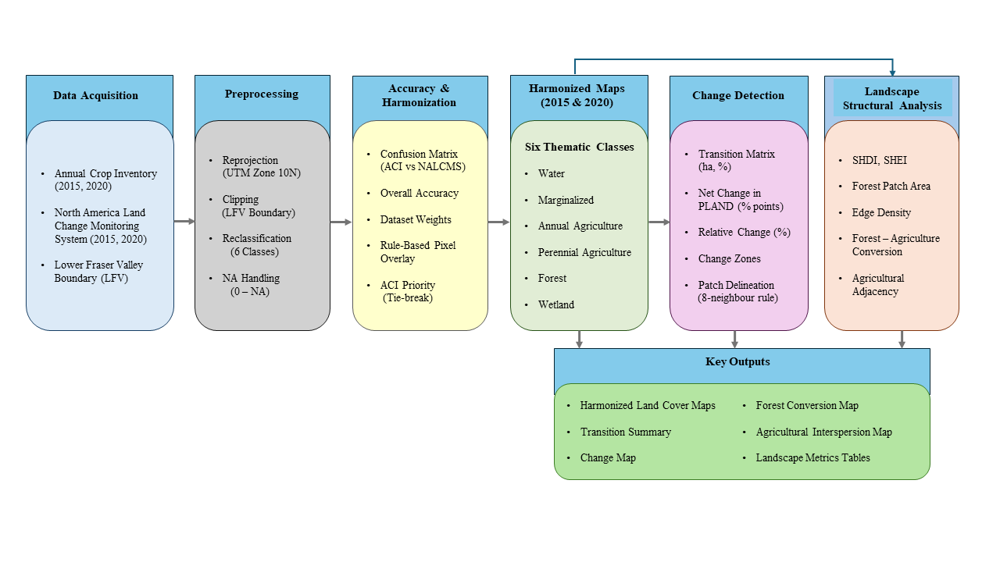
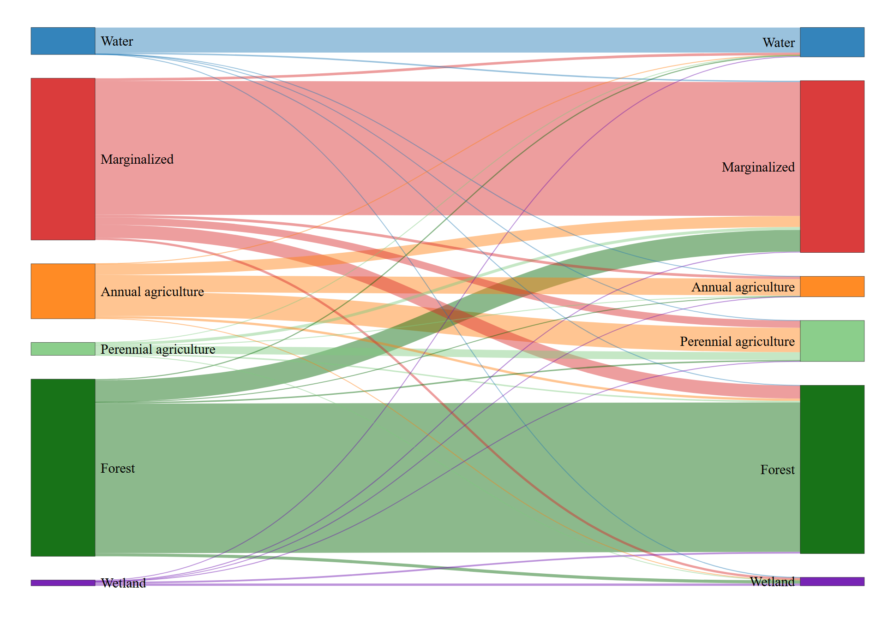

[← Back to Projects](content.html){.back-btn}

### Assessing Critical Transitions in Agricultural Landscapes in the Lower Fraser Valley

**Master’s Capstone Project — University of British Columbia**\
*Aug. 2025 – May 2026*

------------------------------------------------------------------------

## Introduction

Agricultural landscapes in the **Lower Fraser Valley (LFV), British Columbia**, are experiencing structural changes driven by evolving agricultural practices, environmental pressures, and expanding urban development. Understanding how land-cover transitions occur within this highly productive agricultural region is important for supporting sustainable land management and identifying opportunities for resilient farming systems.

This capstone project evaluates how agricultural landscapes in the Lower Fraser Valley changed between **2015 and 2020**, with particular attention to transitions between **annual and perennial agriculture**. By integrating multiple land-cover datasets and applying spatial analysis techniques, the study identifies patterns of land-cover change and areas where perennial agriculture may expand within existing agricultural landscapes.

*Figure 1. Study area showing the Lower Fraser Valley agricultural region analyzed in this project.*

------------------------------------------------------------------------

## Methods

This study integrates two multi-source land-cover datasets—the **Annual Crop Inventory (ACI)** and the **North American Land Change Monitoring System (NALCMS)**—to produce harmonized land-cover maps for 2015 and 2020 and evaluate agricultural landscape dynamics.

First, all datasets were reprojected to UTM Zone 10N and clipped to the Lower Fraser Valley boundary to ensure spatial alignment. Land-cover classes from each dataset were then aggregated into six harmonized categories: Annual Agriculture, Perennial Agriculture, Forest, Marginalized Land, Wetlands, and Water. These categories were selected to maintain ecological relevance while reducing thematic inconsistencies between datasets. :contentReference[oaicite:0]{index="0"}

Dataset agreement was evaluated using confusion matrices, and overall classification agreement was used to derive relative dataset weighting. Harmonization was then performed through pixel-wise overlay, prioritizing ACI classifications in cases of disagreement due to its higher thematic detail for agricultural subclasses.

Following harmonization, post-classification change detection was conducted by comparing the 2015 and 2020 land-cover maps to quantify land-cover transitions and calculate both net and relative changes in landscape composition. Spatial configuration and structural dynamics were further assessed using **patch metrics, diversity indices, and adjacency analysis**.

*Figure 2. Analytical workflow used to harmonize multi-source land-cover datasets and analyze landscape transitions.*

------------------------------------------------------------------------

## Results

### Land-Cover Transitions

Temporal analysis revealed notable shifts in agricultural land cover between 2015 and 2020. **Annual agriculture declined substantially**, while **perennial agriculture increased**, indicating an important structural transition within the agricultural system.

*Figure 4. Sankey diagram illustrating land-cover transitions between 2015 and 2020.*

The largest transition occurred from annual agriculture to perennial agriculture, representing nearly half of the annual agricultural area observed in 2015. Smaller conversions occurred between agricultural classes and marginalized land, as well as limited transitions involving forested areas.

------------------------------------------------------------------------

### Spatial Distribution of Change

Spatial change detection shows that most of the landscape remained stable during the study period, while transitions were concentrated within agricultural regions.

*Figure 5. Spatial distribution of land-cover persistence and change between 2015 and 2020.*

Approximately three-quarters of the landscape remained persistent, while about one-quarter experienced land-cover transitions. These changes occurred across thousands of discrete patches, indicating that most transitions were spatially dispersed rather than large-scale conversions.

------------------------------------------------------------------------

### Agricultural Adjacency

Beyond land-cover transitions, the study examined spatial relationships between annual and perennial agricultural systems.

*Figure 6. Spatial distribution of annual agriculture adjacent to perennial agriculture.*

The proportion of annual agriculture directly adjacent to perennial systems increased substantially between 2015 and 2020. This pattern suggests growing spatial interaction between agricultural classes and highlights areas where **perennial agriculture expansion may occur within existing agricultural landscapes**.

------------------------------------------------------------------------

### Landscape Structural Dynamics

Shannon’s Diversity Index (SHDI) increased slightly from **1.3249 to 1.355**, while Shannon’s Evenness Index (SHEI) increased from **0.7394 to 0.7563**, suggesting a more balanced distribution among land-cover classes over time. These changes reflect shifts in the relative proportions of agricultural and non-agricultural classes across the region. At the class level, mean forest patch area decreased from **12.9 ha to 10.72 ha**, accompanied by a decline in forest edge density, indicating subtle changes in forest spatial configuration within the agricultural landscape. 

Table 1 summarizes landscape-level diversity metrics and selected class-level structural indicators derived from the harmonized land-cover maps.

Table: Landscape structural metrics derived from harmonized land-cover maps.

| Metric | 2015 | 2020 |
|------|------|------|
| Shannon's Diversity Index (SHDI) | 1.3249 | 1.355 |
| Shannon's Evenness Index (SHEI) | 0.7394 | 0.7563 |
| Forest Mean Patch Area (ha) | 12.90 | 10.72 |
| Forest Edge Density (m/ha) | 42.17 | 37.38 |

------------------------------------------------------------------------

## Project Significance

This capstone project demonstrates how harmonized land-cover analysis and spatial landscape metrics can be used to evaluate agricultural transitions and landscape dynamics within complex agricultural regions.

The findings indicate a clear shift from annual to perennial agricultural systems, accompanied by increasing spatial interaction between agricultural classes. These patterns suggest opportunities for supporting more sustainable agricultural practices while maintaining the productivity of the Lower Fraser Valley.

More broadly, the analytical framework developed in this study provides a transferable approach for examining land-cover change, agricultural transitions, and landscape sustainability in other regions.
