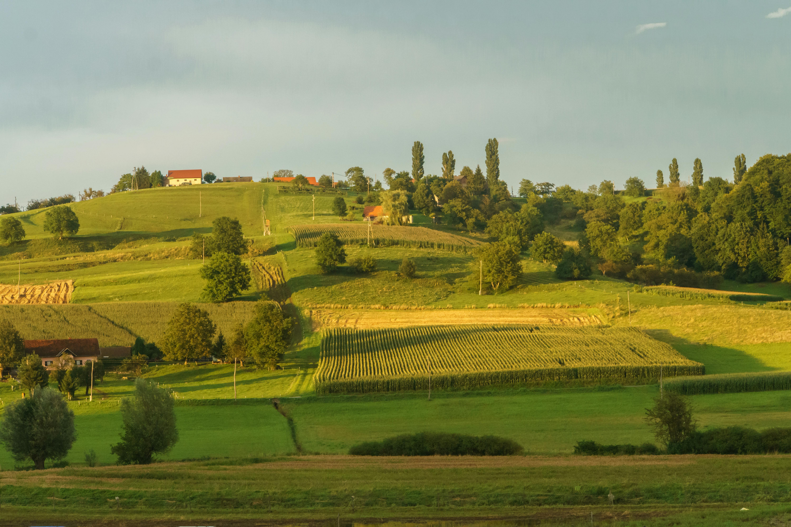

This gallery showcases cartographic layouts and spatial visualizations developed during my studies in Geomatics and GIS.

:::: {.columns}

::: {.column width="33%"}

[{.gallery-img}](agriculture.html)

### [Assessing Critical Transitions in Agricultural Landscapes](agriculture.html)

Harmonized land-cover analysis of agricultural transitions in the Lower Fraser Valley, British Columbia, with emphasis on adjacency, interspersion, and opportunities for perennial agriculture adoption.

:::

::: {.column width="33%"}

[{.gallery-img}](lidar.html)

### [LiDAR-Based Tree Detection and Segmentation](lidar.html)

Forest structure analysis using LiDAR point clouds, canopy height models, and individual tree detection workflows.

:::

::: {.column width="33%"}

[{.gallery-img}](hyperspectral.html)

### [Hyperspectral Vegetation Analysis](hyperspectral.html)

Spectral interpretation of vegetation and non-vegetation classes using reflectance curves and hyperspectral remote sensing workflows.

:::

::::