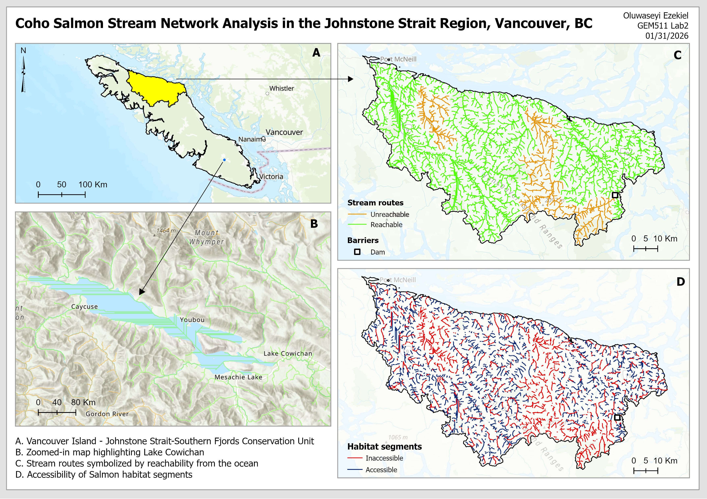
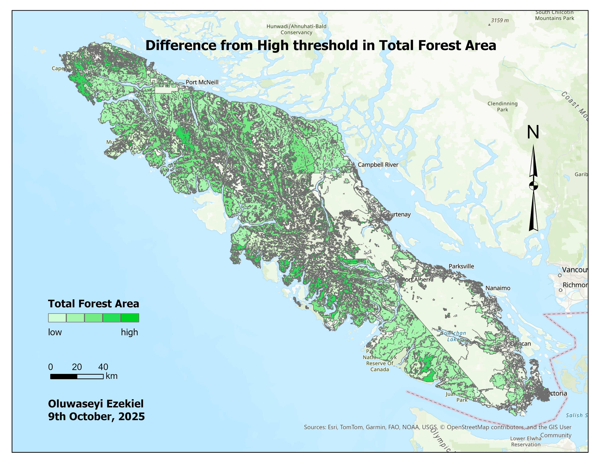
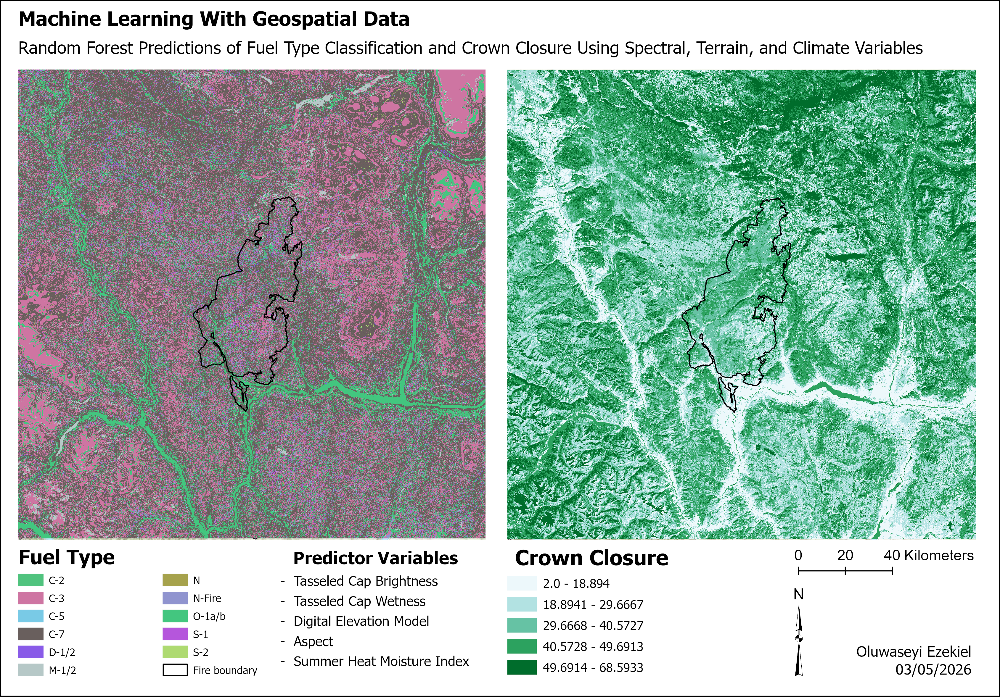
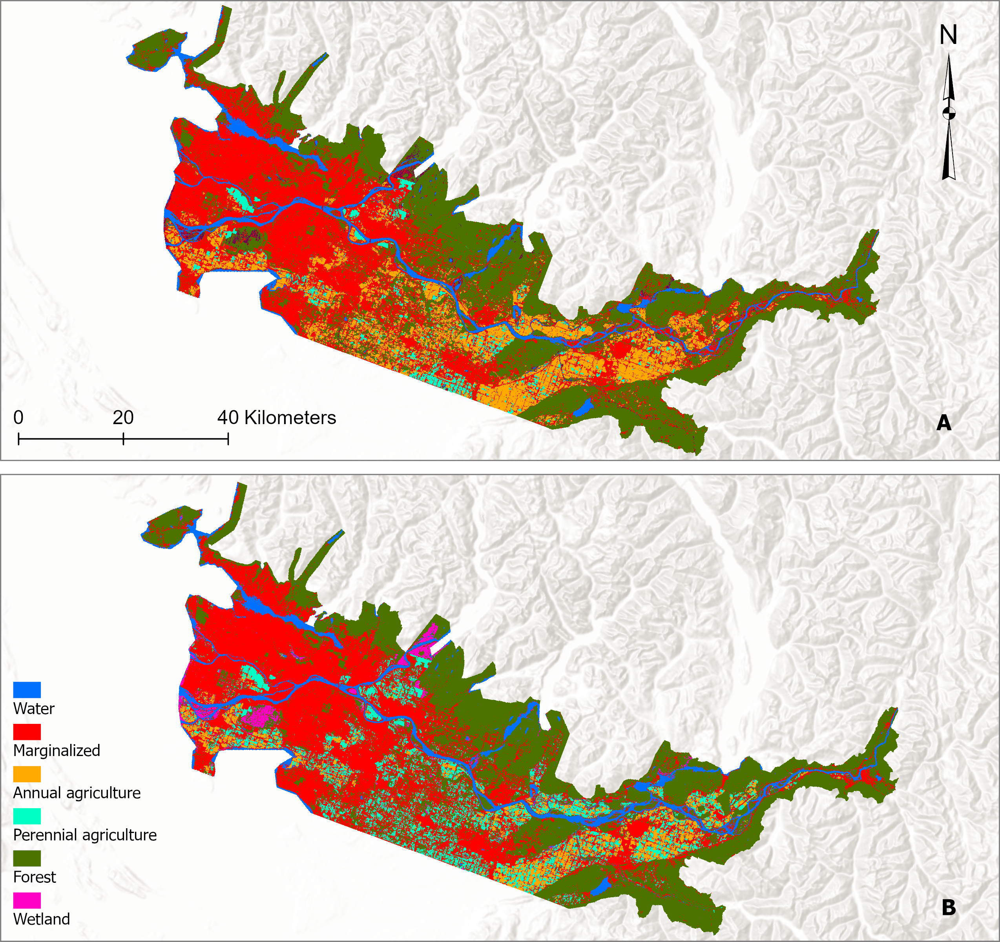
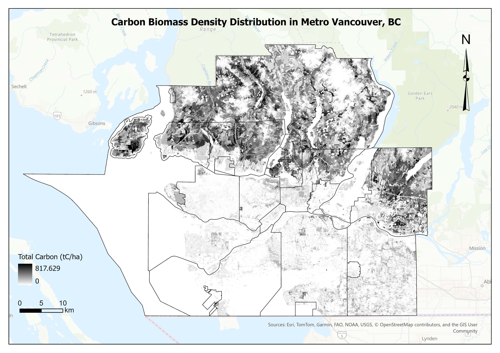

[← Back to Projects](content.html#cartography-page){.back-btn}

::: {.gallery-intro}
## Map Gallery

This gallery showcases layouts of selected GIS and cartographic workflows developed during the Master of Geomatics for Environmental Management program at UBC.

:::

:::: {.map-gallery}

::: {.map-card}

::: {.map-image}
[{fig-alt="GEM 511 Lab 2 Map"}](map_gallery/EzekielO_GEM511_lab2.jpg){target="_blank"}
:::

::: {.map-text}
::: {.map-tag-row}

[Riparian Terrain Analysis]{.map-tag}
:::

## Hydrological Modeling and Stream Network Analysis

Cartographic layout prepared as part of GIS coursework, demonstrating map composition, symbology, labeling, and design principles for effective spatial communication.
:::

:::

::: {.map-card .reverse}

::: {.map-image}
[{fig-alt="GEM 510 Lab 3 Map"}](map_gallery/GEM510_Lab3_map.jpg){target="_blank"}
:::

::: {.map-text}
::: {.map-tag-row}
[Old growth forests]{.map-tag}
[Zonal Statistics]{.map-tag}
:::

## Old Growth Forest Analysis

Map layout created as part of introductory GIS coursework, showcasing cartographic design, thematic mapping, and foundational spatial communication skills.
:::

:::

::: {.map-card}

::: {.map-image}
[{fig-alt="GEM 511 Lab 4 Map"}](map_gallery/EzekielO_GEM511_lab4.png){target="_blank"}
:::

::: {.map-text}
::: {.map-tag-row}
[Machine learning]{.map-tag}
[Spatial Analysis]{.map-tag}
:::

## Machine Learning with Geospatial Data

GIS project applying machine learning techniques to analyze spatial patterns and relationships within geospatial datasets. The resulting map visualizes model outputs and demonstrates how predictive spatial analysis can support environmental and geographic decision-making.
:::

:::

::: {.map-card .reverse}

::: {.map-image}
[{fig-alt="Harmonized Land-Cover Maps"}](map_gallery/harmonized_maps.png){target="_blank"}
:::

::: {.map-text}
::: {.map-tag-row}
[Data Harmonization]{.map-tag}
:::

## Multisource Land-Cover Dataset Harmonization

Comparison of harmonized land-cover datasets used to analyze agricultural transitions in the Lower Fraser Valley  between 2015 and 2020.
:::

:::

::: {.map-card}

::: {.map-image}
[{fig-alt="Change Detection Map"}](map_gallery/change_map.png){target="_blank"}
:::

::: {.map-text}
::: {.map-tag-row}
[Land Cover Classification]{.map-tag}
[Change Detection]{.map-tag}
:::

## Time Series Analysis

Spatial representation of land-cover change across the Lower Fraser Valley, highlighting where transitions and stable classes occurred over time. 
:::

:::

::: {.map-card .reverse}

::: {.map-image}
[{fig-alt="Agricultural Adjacency Analysis"}](map_gallery/adjacency.png){target="_blank"}
:::

::: {.map-text}
::: {.map-tag-row}
[Spatial correlation]{.map-tag}
[Landscape Pattern Analysis]{.map-tag}
:::

## Agricultural Adjacency Analysis

Visualization of adjacency and interspersion patterns between agricultural classes. This map shows regions of annual agricultural that are likely to transition into perennial classes in the near future.
:::

:::

::: {.map-card .reverse}

::: {.map-image}
[{fig-alt="Carbon Density Map"}](map_gallery/carbon_density_map.jpg){target="_blank"}
:::

::: {.map-text}
::: {.map-tag-row}
[Carbon Management]{.map-tag}
[Environmental Mapping]{.map-tag}
:::

## Carbon Density Mapping

Spatial visualization of carbon density patterns across MetroVancouver, BC, Canada. This map supports urban management planning and operational decisions in environmental management.

:::

:::