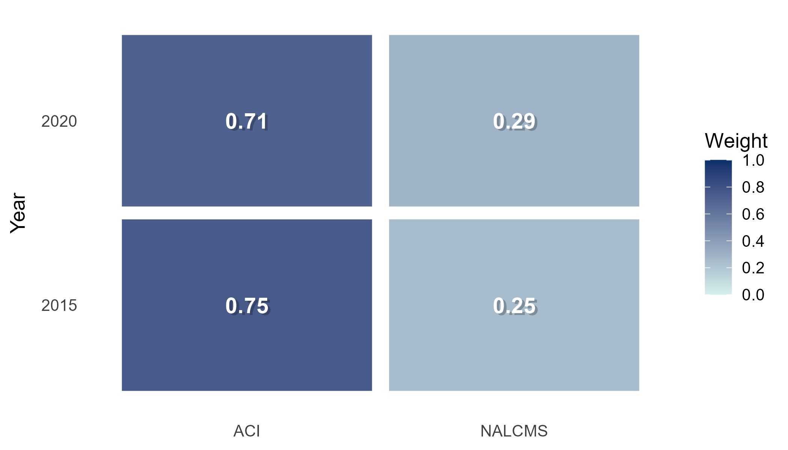
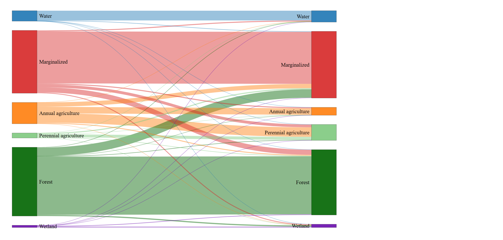

## Map Gallery

This gallery showcases cartographic layouts and spatial visualizations developed during my studies in geomatics and GIS.

:::::: columns
::: {.column width="33%"}
[{.gallery-img}](images/harmonized_maps.png)

**Harmonized Land-Cover Maps**

Comparison of harmonized land-cover datasets used to analyze agricultural transitions in the Lower Fraser Valley.
:::

::: {.column width="33%"}
[{.gallery-img}](images/change_map2.png)

**Change Detection Map**

Spatial representation of land-cover change across the study area.
:::

::: {.column width="33%"}
[{.gallery-img}](images/adjacency.png)

**Agricultural Adjacency Analysis**

Visualization of adjacency and interspersion patterns between agricultural classes.
:::
::::::

:::::: columns
::: {.column width="33%"}
[{.gallery-img}](images/normalized_weights.png)

**Normalized Dataset Weights**

Visualization of dataset weighting used during land-cover harmonization.
:::

::: {.column width="33%"}
[{.gallery-img}](images/sankey_2015_2020.png)

**Land-Cover Transition Sankey**

Diagram illustrating transitions between land-cover classes from 2015 to 2020.
:::

::: {.column width="33%"}
[{.gallery-img}](images/forest-agric.png)

**Forest–Agriculture Spatial Patterns**

Map showing spatial relationships between forest cover and agricultural land uses.
:::
::::::
