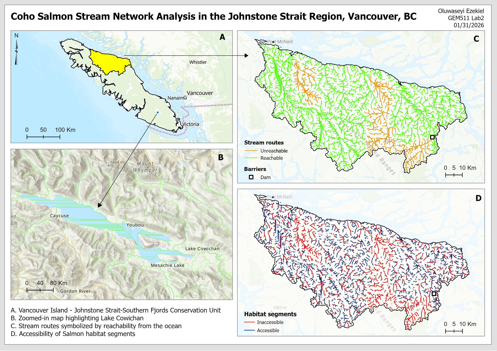
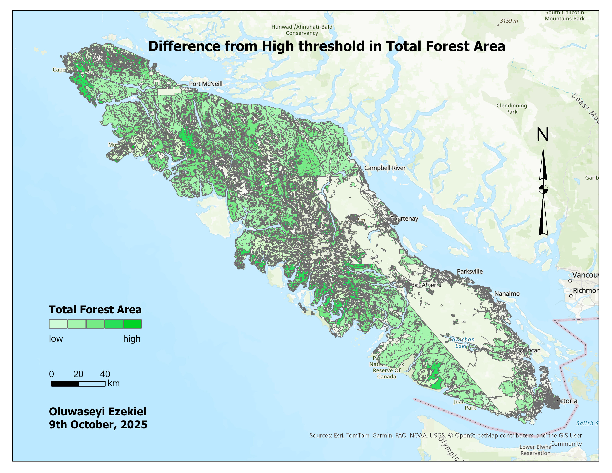
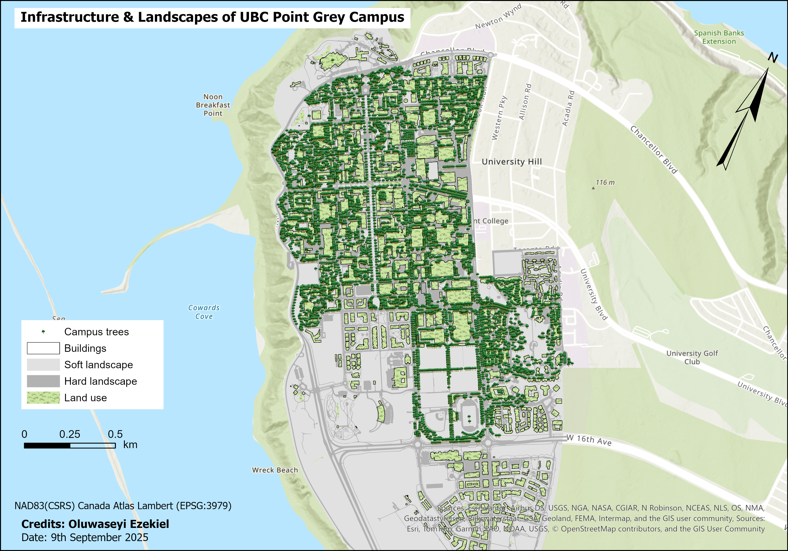
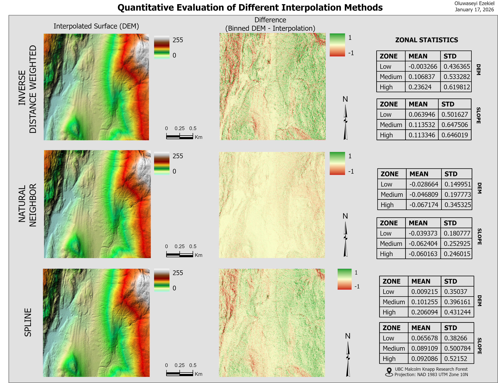
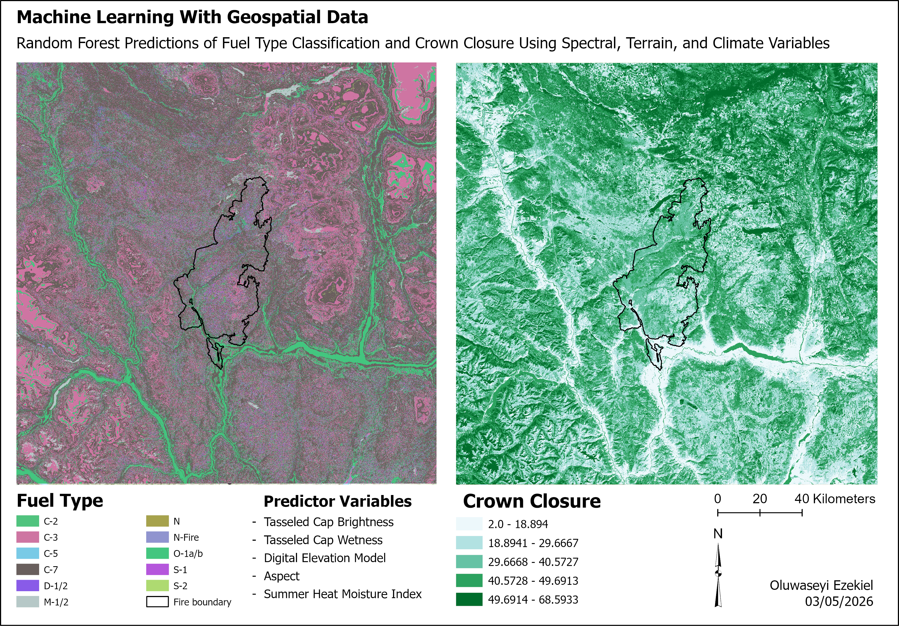
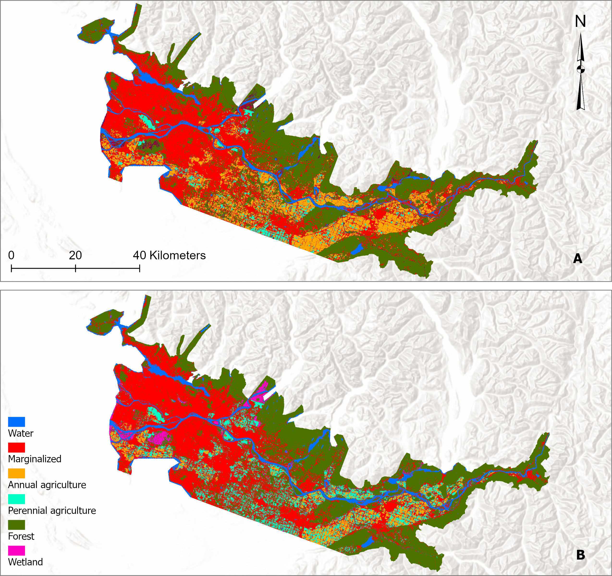
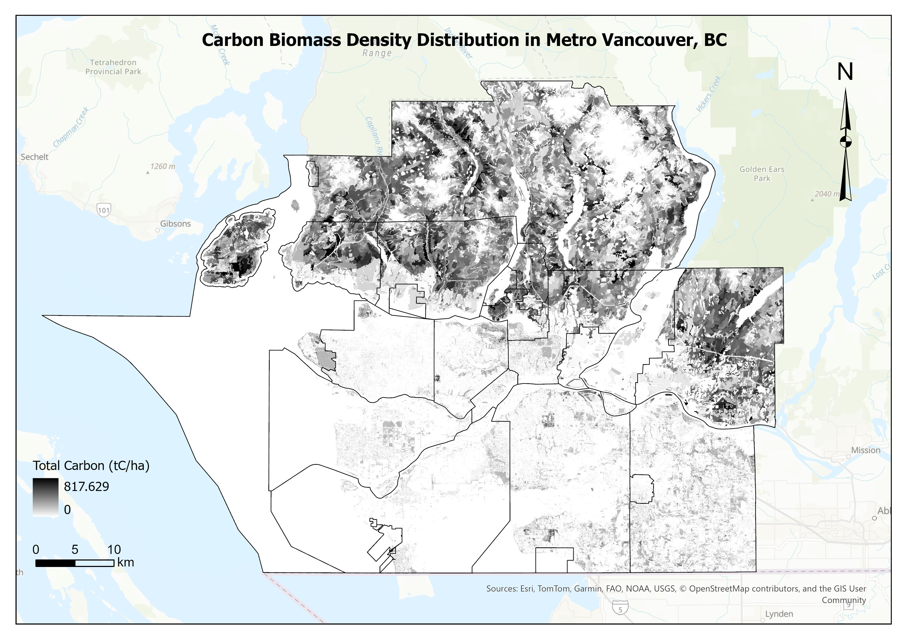

[← Back to Projects](content.html#cartography-page){.back-btn}

::: {.gallery-intro}
## Map Gallery

This gallery showcases layouts of selected GIS and cartographic workflows developed during the Master of Geomatics for Environmental Management program at UBC.

:::

:::: {.map-gallery}

::: {.map-card}

::: {.map-image}
[{fig-alt="Hydrological Modeling"}](map_gallery/stream_network.jpg){target="_blank"}
:::

::: {.map-text}
::: {.map-tag-row}

[Hydrological Modeling]{.map-tag}
[Geolocation]{.map-tag}
:::

## Stream Network Analysis

This project applies spatial network analysis methods to understand how environmental features and infrastructure are connected. It identifies the components of geolocated networks and examines how different network structures influence movement and accessibility within a landscape. The project also focuses on building spatial networks and evaluating them using metrics such as topology and impedance.
:::

:::

::: {.map-card .reverse}

::: {.map-image}
[{fig-alt="Old Growth Forest Analysis"}](map_gallery/old_growth.jpg){target="_blank"}
:::

::: {.map-text}
::: {.map-tag-row}
[Old growth forests]{.map-tag}
[Cartographic modelling]{.map-tag}
:::

## Old Growth Forest Analysis

This project integrates inventory variables such as species composition, age, density, and productivity into spatial layers suitable for analysis and visualization. The project also aims to build cartographic models that represent key stand attributes that inform decisions in forest management.
:::

:::

::: {.map-card .reverse}

::: {.map-image}
[{fig-alt="Riparian Terrain Modeling"}](map_gallery/riparian.png){target="_blank"}
:::

::: {.map-text}
::: {.map-tag-row}
[Hydrology]{.map-tag}
[Digital Elevation Modeling]{.map-tag}
[Stream Network]{.map-tag}
:::

## Riparian Terrain Analysis

This project uses a Digital Elevation Model to map and classify stream networks, assess fish-bearing potential, and delineate Riparian Management Areas in the Nahmint Valley, BC — following BC's Forest Practices Code to define Reserve and Management Zones that guide harvest planning decisions.
[View full project →](riparian.qmd){.project-link}
:::

:::

::: {.map-card .reverse}

::: {.map-image}
[{fig-alt="Riparian Terrain Modeling"}](map_gallery/infra_mgt.png){target="_blank"}
:::

::: {.map-text}
::: {.map-tag-row}
[Landscape mapping]{.map-tag}
[QGIS]{.map-tag}
:::

## Infrastructure Management

This map was created by importing UBC campus datasets into a PostgreSQL/PostGIS database. Basic SQL queries to extract feature layers such as buildings, trees, and landscape types. These layers were then visualized using ArcGIS Pro to illustrate infrastructure and landscape patterns across the UBC Point Grey campus.
:::

:::

::: {.map-card .reverse}

::: {.map-image}
[{fig-alt="Spatial Interpolation"}](map_gallery/interpolation.png){target="_blank"}
:::

::: {.map-text}
::: {.map-tag-row}
[Inverse Distance Weighting]{.map-tag}
[Natural Neighbor]{.map-tag}
[Spline]{.map-tag}
:::

## Comparing Spatial Interpolation Approaches

The objective of this project is to evaluate how interpolation methods influence terrain representation and the accuracy of derived spatial analyses. It focuses on creating terrain surfaces from elevation data using spatial interpolation techniques such as inverse distance weighting (IDW), kriging, and spline to generate digital terrain models.
:::

:::

::: {.map-card}

::: {.map-image}
[{fig-alt="Machine learning with Geospatial Data"}](map_gallery/machine_learning.png){target="_blank"}
:::

::: {.map-text}
::: {.map-tag-row}
[Machine learning]{.map-tag}
[Spatial Analysis]{.map-tag}
:::

## Machine Learning with Geospatial Data

In this project, a Random Forest model was applied to geospatial data to predict fuel type classes and crown closure across the study area. The workflow used a suite of spectral, terrain, and climate predictors as inputs to the classification and regression models. The Random Forest classifier generated spatial patterns of fuel type distribution, while a regression‑based forest model produced continuous crown‑closure estimates. 
:::

:::

::: {.map-card .reverse}

::: {.map-image}
[{fig-alt="Harmonized Land-Cover Maps"}](map_gallery/harmonized_maps.png){target="_blank"}
:::

::: {.map-text}
::: {.map-tag-row}
[Data Harmonization]{.map-tag}
:::

## Multisource Land-Cover Dataset Harmonization

This map shows the harmonized maps derived from integrating multi-source land-cover products: Annual Crop Inventory (ACI) and North America Land Change Monitoring System (NALCMS). This harmonization supports more reliable analysis of agricultural transitions and long‑term land‑use change.
:::

:::

::: {.map-card}

::: {.map-image}
[{fig-alt="Change Detection Map"}](map_gallery/change_map.png){target="_blank"}
:::

::: {.map-text}
::: {.map-tag-row}
[Land Cover Classification]{.map-tag}
[Change Detection]{.map-tag}
:::

## Time Series Analysis

This map compares classified outputs from multiple time periods to illustrates land‑cover dynamics across the Lower Fraser Valley. Areas shown in yellow represent detected change zones where land‑cover classes shifted between observation years, while dark gray highlights persistence across the five-year period.
:::

:::

::: {.map-card .reverse}

::: {.map-image}
[{fig-alt="Agricultural Adjacency Analysis"}](map_gallery/adjacency.png){target="_blank"}
:::

::: {.map-text}
::: {.map-tag-row}
[Lower Fraser Valley]{.map-tag}
[Landscape Pattern Analysis]{.map-tag}
:::

## Agricultural Adjacency Analysis

This map shows the spatial adjacency relationships between annual and perennial agricultural classes across the Lower Fraser Valley. Agricultural interspersion patterns support assessments of agricultural expansion, land‑use dynamics, and potential crop‑type shifts driven by management decisions or environmental conditions.
:::

:::

::: {.map-card .reverse}

::: {.map-image}
[{fig-alt="Carbon Density Map"}](map_gallery/carbon_density_map.jpg){target="_blank"}
:::

::: {.map-text}
::: {.map-tag-row}
[Carbon Management]{.map-tag}
[Environmental Mapping]{.map-tag}
:::

## Carbon Density Mapping

This map shows the spatial distribution of above‑ground carbon biomass density across Metro Vancouver. High‑density carbon zones appear in the North Shore and other forested uplands, gradually transitioning to lower values within developed municipalities. The project supports applications in urban planning and carbon‑accounting initiatives, offering spatial insight into where ecosystem restoration actions may have the greatest impact.

:::

:::