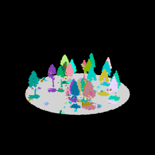
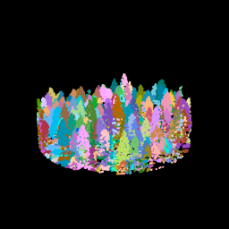
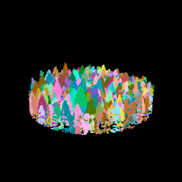
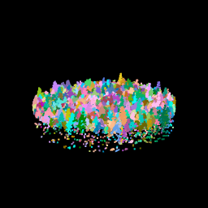
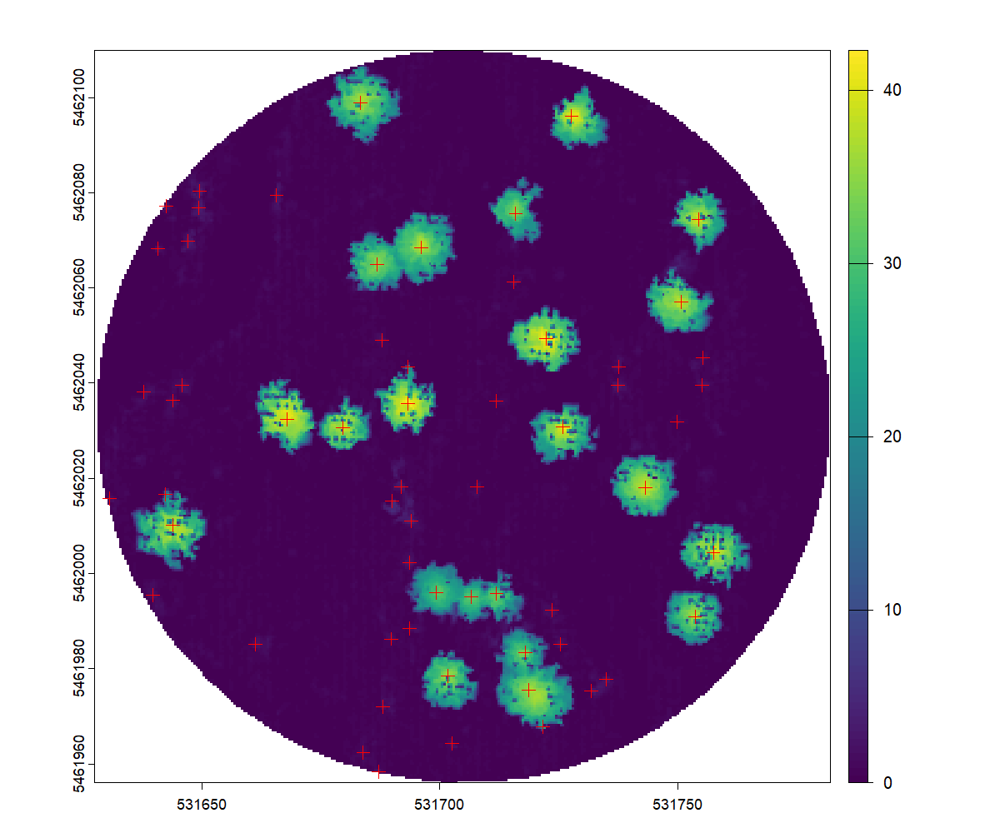
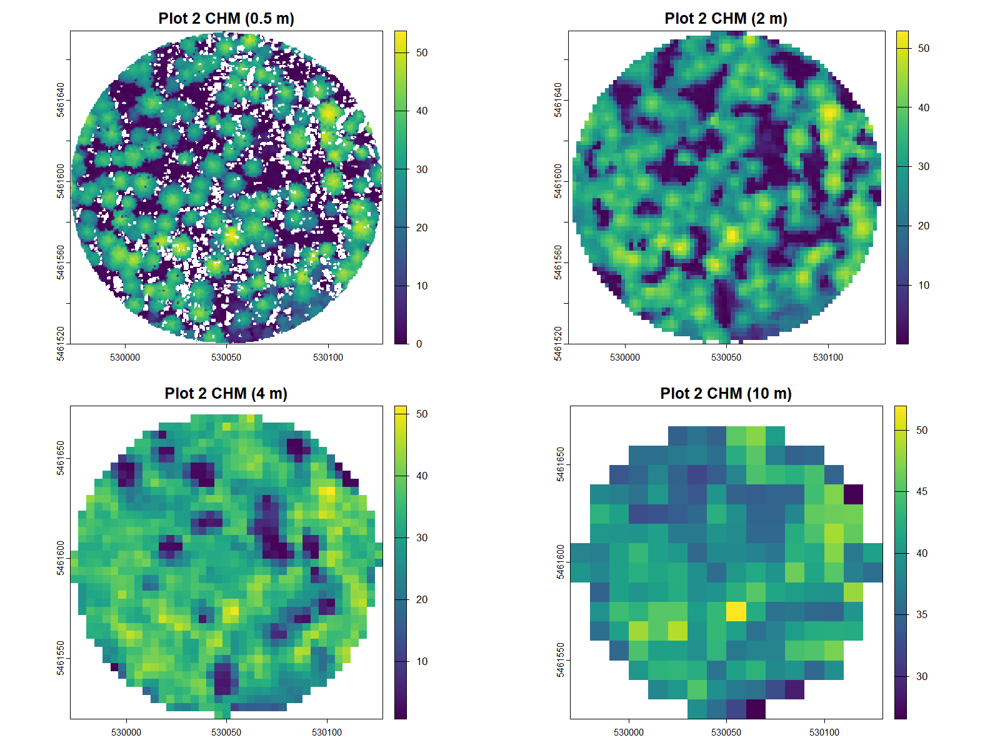
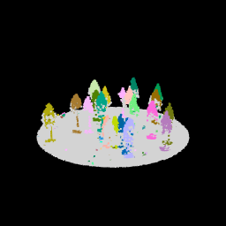
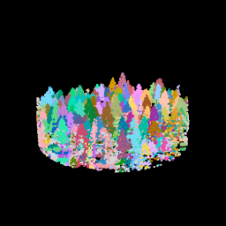

[← Remote Sensing Projects](remote-sensing.html){.back-btn}

# Individual Tree Detection in Malcolm Knapp Research Forest

📍 Maple Ridge, BC · 📅 February 2026

**Tools**: R · lidR · LiDAR

------------------------------------------------------------------------

*Can an algorithm find every tree in a dense BC forest? In a structurally complex mixed coniferous stand, crown overlap and multi‑layered canopy structure make this a far more difficult question than it seems.*

------------------------------------------------------------------------

## The Problem

### *Why individual trees matter — and why they're hard to isolate*

Forest inventory traditionally summarizes canopy structure over grid cells. But per‑tree metrics — height, crown area, stem density — drive carbon accounting, habitat modelling, and harvest planning.

In BC's mixed coniferous forests, overlapping crowns and dense lower‑storey branches make it difficult for algorithms to determine where one tree ends and another begins.

------------------------------------------------------------------------

## The Data

### *Four circular plots, millions of points*

I extracted four 154‑m diameter plots from a normalized LiDAR catalog covering Malcolm Knapp Research Forest. Height outliers were removed to prevent false detections.

``` r
ctg <- readLAScatalog(norm_dir)
opt_filter(ctg) <- "-drop_z_below 0 -drop_z_above 65"

radius <- 77
for(i in 1:4) {
  x <- plots_tbl$X[i]; y <- plots_tbl$Y[i]
  p <- clip_circle(ctg, x, y, radius)
  writeLAS(p, file.path(plots_dir, paste0("Lab4_Plot_", i, ".las")))
}
```

------------------------------------------------------------------------

## Algorithm 1 — Li et al. (2012)

### *Starting from the top: segmentation in 3D*

Li2012 begins segmentation at the top of the canopy, where crown spacing is greatest. The `speed_up` parameter defines the maximum crown radius.

``` r
li12 <- li2012(dt1=1.5, dt2=2, R=2, Zu=15, speed_up=10)

for(i in 1:4) {
  Plt      <- readLAS(file.path("Plots", paste0("Lab4_Plot_", i, ".las")))
  Plt_li12 <- segment_trees(Plt, li12)
  plot(Plt_li12, color="treeID")
}
```









------------------------------------------------------------------------

## Building the Surface

### *From point cloud to canopy height model*

Dalponte2016 requires a CHM. I generated a 0.5 m pitfree CHM and detected tree tops using a local maximum filter.



------------------------------------------------------------------------

## Resolution Matters

### *CHM at four resolutions*

I compared CHMs at 0.5 m, 2 m, 4 m, and 10 m. 2 m provided the best balance between detail and noise.



------------------------------------------------------------------------

## Algorithm 2 — Dalponte & Coomes (2016)

### *Growing crowns outward from tree tops*





------------------------------------------------------------------------

## Algorithm Comparison

Li2012 and Dalponte2016 didn't just produce different segmentation maps — they revealed different blind spots in how each method interprets forest structure. The table below summarizes their strengths, weaknesses, and ideal use‑cases.

| Algorithm | Strengths | Failure Mode | Best Used In |
|----|----|----|----|
| **Dalponte2016** | Produces clean, intuitive crown boundaries when the CHM surface is smooth and distinct. | Merges adjacent crowns when the CHM forms a single ridge in dense stands. | Open, even‑aged stands with well‑separated crowns and reliable CHM structure. |
| **Li2012** | More resilient in dense, multi‑layered stands due to its 3D, point‑based logic. | Struggles where lower‑storey branches from neighbouring trees intertwine. | Dense, structurally complex stands where 3D segmentation prevents crown merging. |

------------------------------------------------------------------------

## What this means for operational forest inventory

No single algorithm is universally "best" across a heterogeneous forest like MKRF. A practical workflow needs to adapt to stand structure.

The key insight: across the entire forest, **CHM resolution influenced results more than the choice of algorithm.** A 2 m CHM provided the strongest balance between structural detail, noise suppression, and computational efficiency.
