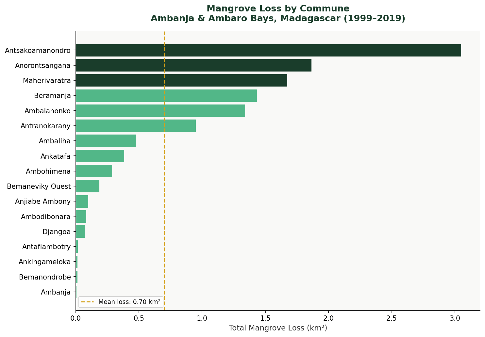
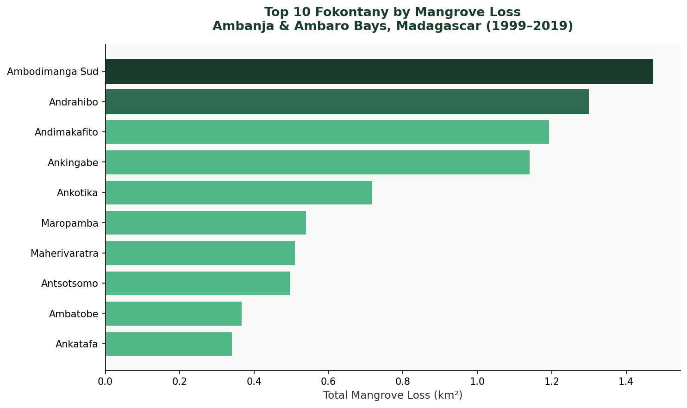
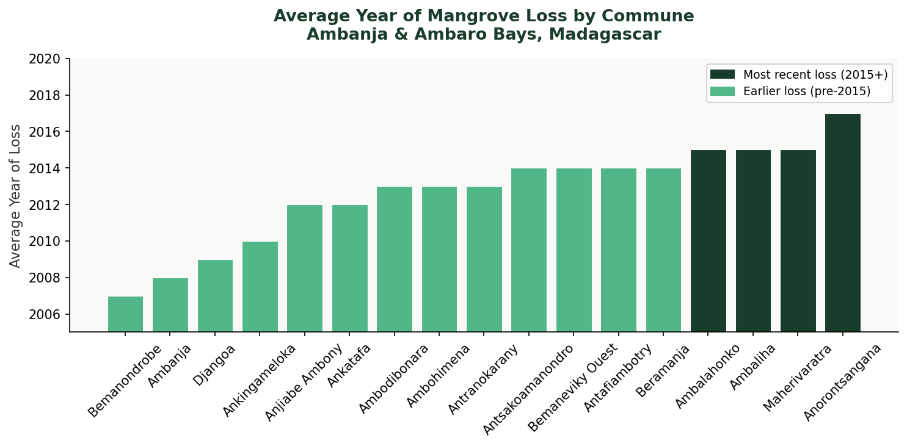
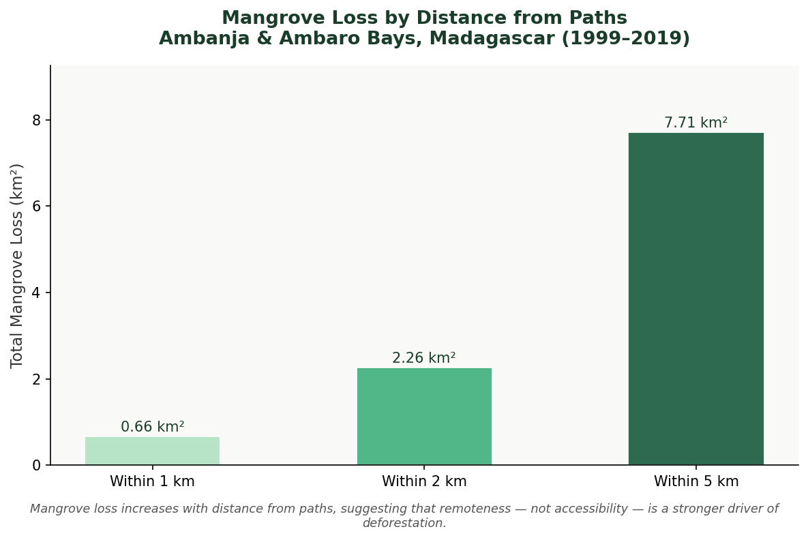

[← Back to Projects](content.html){.back-btn}

# Mangrove Deforestation Analysis — Ambanja & Ambaro Bays, Madagascar

📍 Madagascar · 📅 November 2025

**Tools**: Python · ArcPy · Google Earth Engine

------------------------------------------------------------------------

*Which communities are losing the most mangrove forest — and does proximity to human infrastructure explain it? In Madagascar's Ambanja and Ambaro Bays, a Python-based spatial pipeline built the answer from the ground up.*

------------------------------------------------------------------------

## The Problem

### *One of the world's most productive ecosystems — vanishing fast*

Mangrove forests store extraordinary amounts of carbon, protect coastlines from storm surges, and sustain the livelihoods of coastal communities. In Madagascar, they are under pressure from timber harvesting, agricultural expansion, and aquaculture — driven by population growth and limited governance.

This project quantifies mangrove loss between **1999 and 2019** at two administrative scales — commune and fokontany — and tests whether proximity to paths and permanent rivers explains spatial patterns of deforestation.

------------------------------------------------------------------------

## The Data

### *A global dataset, downloaded from Google Earth Engine*

The **Murray Global Tidal Wetland Change dataset** (Murray et al. 2022) maps tidal wetland gain and loss globally using over 1 million Landsat images combined with machine learning. It was downloaded for this project via a Google Earth Engine script, with NA values encoded as 0 in the raster.

Administrative boundaries — communes and fokontany — and infrastructure layers including paths and permanent rivers were sourced from the AAB geodatabase.

------------------------------------------------------------------------

## Step 1 — Pre-Processing

### *Converting pixels to polygons — and cleaning the noise*

The Murray raster encodes mangrove loss year as pixel values, with 0 representing no data. The first task was converting it to polygon format for vector-based spatial analysis, then using ArcPy cursors to remove null records and rename the gridcode field to `loss_year`.

``` python
arcpy.conversion.RasterToPolygon(
    original, opath,
    "NO_SIMPLIFY",
    raster_field = 'Value'
)

# Rename gridcode to loss_year
arcpy.management.AlterField(mangrove_polygon_name, 'gridcode', 'loss_year')

# Remove null polygons using UpdateCursor
with arcpy.da.UpdateCursor(mangrove_polygon_name, 'loss_year') as cursor:
    for row in cursor:
        if row[0] == 0:
            cursor.deleteRow()
```

------------------------------------------------------------------------

## Step 2 — Loss by Commune

### *Where is deforestation most severe?*

The cleaned polygons were spatially joined to commune boundaries. Area was calculated using `CalculateGeometryAttributes()`, then summarized with `arcpy.analysis.Statistics()` — grouping by commune to produce total loss area (km²) and average loss year.

``` python
arcpy.analysis.Statistics(
    in_table = joined_layer,
    out_table = summary_table,
    statistics_fields = [["Shape_Area", "SUM"], ["loss_year", "MEAN"]],
    case_field = "COMMUNE"
)
```



------------------------------------------------------------------------

## Step 3 — Fokontany Scale

### *Zooming in: sub-commune hotspots*

The same workflow was repeated at the fokontany level — a finer administrative unit — revealing deforestation hotspots that commune-level analysis would mask.



------------------------------------------------------------------------

## Step 4 — Temporal Trend

### *When did deforestation peak?*

A histogram of loss year revealed that mangrove loss increased steadily until peaking around 2016, with a slight decline afterward. The map of average loss year by commune shows most deforestation concentrated between **2012 and 2015**.



------------------------------------------------------------------------

## Step 5 — Proximity Analysis

### *Does accessibility drive deforestation?*

Multi-ring buffers of **1 km, 2 km, and 5 km** were applied around paths and permanent rivers, then intersected with mangrove loss polygons to quantify deforestation within each distance band.

``` python
arcpy.analysis.Buffer(
    in_features = paths_layer,
    out_feature_class = buffer_output,
    buffer_distance_or_field = "1000 Meters",
    dissolve_option = "ALL"
)

arcpy.analysis.Intersect(
    in_features = [buffer_output, mangrove_polygon_name],
    out_feature_class = intersect_output
)
```



------------------------------------------------------------------------

## Key Findings

Most loss occurred between 2012 and 2015. At the commune level, Antsakoamanondro experienced the greatest loss, while Ambodimanga Sud led at the fokontany level. The proximity analysis revealed a counter-intuitive pattern — loss increased with distance from paths, pointing to subsistence expansion into remote coastal areas rather than direct infrastructure-driven clearing.

| Finding | Detail |
|----|----|
| Most affected commune | Antsakoamanondro (\~3.05 km²) |
| Most affected fokontany | Ambodimanga Sud (\~1.47 km²) |
| Peak loss period | 2012–2015 |
| Loss within 1 km of paths | 0.66 km² |
| Loss within 5 km of paths | 7.71 km² |
| Key insight | Remoteness, not accessibility, appears to drive loss |

------------------------------------------------------------------------

## What this means for conservation planning

The spatial pattern of loss — concentrated in specific communes and fokontany, and increasing with distance from paths — suggests deforestation in the Ambanja and Ambaro Bays is driven more by subsistence expansion into remote coastal areas than by direct infrastructure access.

This Python-based pipeline — raster conversion, cursor-based cleaning, spatial joins, buffer intersections, and structured Excel outputs — demonstrates how ArcPy automation can efficiently process large environmental datasets to generate actionable, governance-ready spatial insights.
