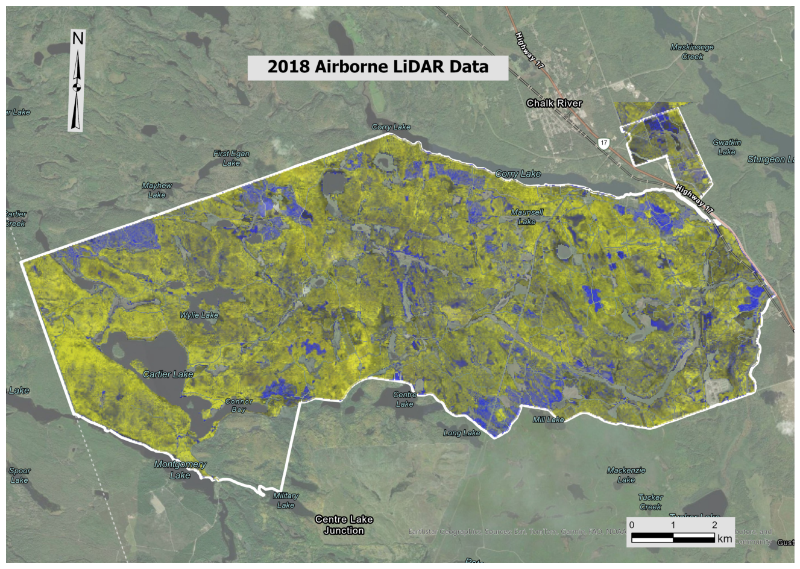
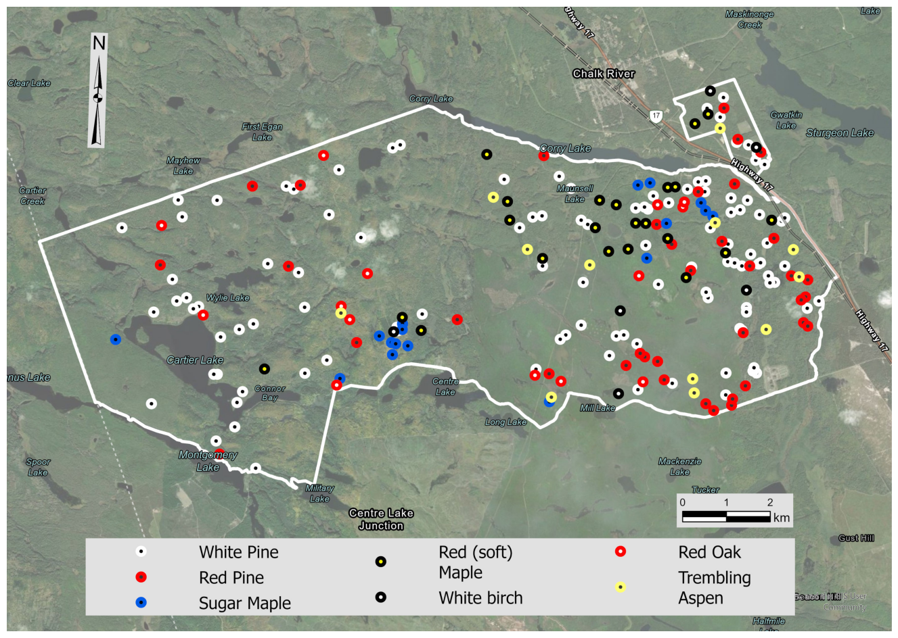
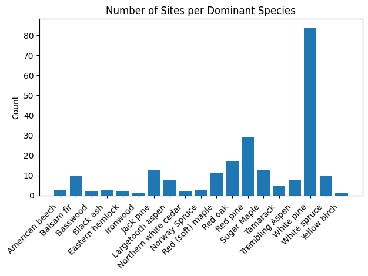
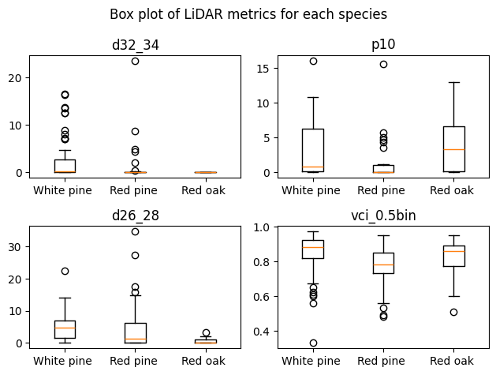

```{=html}
<style>
.code-block {
  background-color: #1a2a2a;
  border-radius: 8px;
  margin: 1.2em 0;
  overflow: hidden;
  font-family: 'Courier New', Courier, monospace;
}
.code-block-label {
  background-color: #2a3d3d;
  color: #a0c8b0;
  font-size: 0.78em;
  padding: 6px 14px;
  letter-spacing: 0.03em;
}
.code-block pre {
  background: none !important;
  color: #d4e8d4;
  margin: 0;
  padding: 16px 18px;
  font-size: 0.88em;
  line-height: 1.6;
  white-space: pre;
  overflow-x: auto;
}
</style>
```

[← Back to Projects](content.html){.back-btn}

# Mapping Dominant Tree Species in the Petawawa Research Forest with LiDAR

📍 Petawawa Research Forest, Ontario · 📅 April 2025

**Tools**: Python · LiDAR · scikit-learn

**Team**: Agness Chisale · Oluwaseyi Ezekiel · N. Tyler Goncalves

------------------------------------------------------------------------

*Can LiDAR alone tell a white pine from a red oak? In Ontario's Petawawa Research Forest, we built a Python-based exploration pipeline to find out — and discovered where the data falls short before a single model is trained.*

------------------------------------------------------------------------

## Introduction

### *Forest inventory is changing — and LiDAR is at the centre of it*

Dominant tree species information is essential for forest management. Different species shape wildlife habitat, timber value, biodiversity, and cultural priorities. Traditional mapping relied on sample plots and air photo interpretation — slow, expensive, and limited in coverage.

Remote sensing offers a scalable alternative. Multispectral imagery detects species through spectral signatures. LiDAR is more challenging — it typically uses a single wavelength — but captures detailed forest structure, and studies show species often have distinct vertical and canopy patterns.

This project investigates whether LiDAR structural metrics alone can reliably classify dominant tree species in the Petawawa Research Forest.

------------------------------------------------------------------------

## Motivation

### *Ontario's push toward an Enhanced Forest Inventory*

Ontario is transitioning to an Enhanced Forest Inventory (EFI), aiming to replace manual methods with remote-sensing-based models that are more consistent, scalable, and cost-efficient. Dominant species classification is a key component of EFI workflows.

The Ministry of Natural Resources wants to know: is newly collected ALS (LiDAR) data sufficient for operational species mapping — or is multispectral data still required?

**Key question:** Is LiDAR alone accurate enough to model dominant tree species, or must it be fused with multispectral data?

------------------------------------------------------------------------

## The Data

### *Two datasets — one structural, one ground-truth*

The **Airborne Laser Scanning (ALS) metrics** dataset provides 2018 wall-to-wall LiDAR coverage of the Petawawa Research Forest. Rather than raw point clouds, it delivers 67 statistical summaries per cell at 25 m spatial resolution — capturing canopy height, density, and vertical structure.

Ground truth comes from the **Petawawa Research Forest plot data**: field-surveyed plot locations for approximately 30 tree species, sampled in summer 2018, each labelled with a dominant species code.





------------------------------------------------------------------------

## Step 1 — Cleaning

### *Removing missing data and filtering rare species*

Limitations in the original point cloud's data structure meant some sites had no ALS coverage. These were removed before analysis. ALS and plot data were kept in separate dataframes to support future scikit-learn workflows requiring separate class and attribute inputs.

```{=html}
<div class="code-block">
  <div class="code-block-label">Python — Filter NaN Sites</div>
  <pre>
# Find the indexes of rows containing NaN
bad_data = lidar_data.isnull().any(axis=1).tolist()

# Filter these rows out of both datasets
which       = np.logical_not(bad_data)
plots_good  = plot_data[which]
lidar_good  = lidar_data[which]
  </pre>
</div>
```

Looking at the species distribution, plots are dominated by white pine — potentially representative of the forest, but insufficient to build training, validation, and test sets for all classes. Species with fewer than 15 observations were excluded, leaving three proceeding species: **White Pine · Red Pine · Red Oak**.

```{=html}
<div class="code-block">
  <div class="code-block-label">Python — Filter to Target Species</div>
  <pre>
# Keep only species with at least 15 plots
trg_species = (plots_good['Species']
               .value_counts()
               .loc[lambda count: count >= 15]
               .index.tolist())

species_filter = plots_good['Species'].isin(trg_species)
plots_final    = plots_good[species_filter]
lidar_final    = lidar_good[species_filter]
  </pre>
</div>
```



------------------------------------------------------------------------

## Step 2 — Feature Correlation

### *Which ALS metrics relate most to species?*

With 67 available bands, feature selection was critical. `mutual_info_classif` from scikit-learn calculates the mutual information between each attribute and the target class individually — providing a ranked view of which LiDAR metrics carry the most species signal.

```{=html}
<div class="code-block">
  <div class="code-block-label">Python — Mutual Information Feature Ranking</div>
  <pre>
from sklearn.feature_selection import mutual_info_classif

# Prepare data
y = plots_final['Code'].map({1: 1, 2: 2, 41: 3})
X = lidar_final.drop('plot', axis=1)

# Rank features by mutual information with species class
mi        = mutual_info_classif(X, y, discrete_features='auto')
mi_scores = pd.Series(mi, index=X.columns).sort_values(ascending=False)
print(mi_scores.head())
  </pre>
</div>
```

------------------------------------------------------------------------

## Step 3 — Visualisation

### *Box plots: can the top metrics separate species?*

To understand whether the highest-ranked features can distinguish the three species, box plots were used to show the distribution overlap of each class across each attribute. The Vertical Complexity Index (VCI) was included as a hypothesis test — intuitively, canopy vertical structure should reflect species differences.

```{=html}
<div class="code-block">
  <div class="code-block-label">Python — Box Plot Grid</div>
  <pre>
classes = [lidar_final[y == i+1] for i in range(3)]
metrics = mi_scores[0:3].index.tolist() + ['vci_0.5bin']

fig, axs = plt.subplots(2, 2)
for i, ax in enumerate(axs.flat):
    metric = metrics[i]
    spread = [cl[metric] for cl in classes]
    ax.boxplot(spread)
    ax.set_xticklabels(trg_species)
    ax.set_title(metric)

plt.suptitle('Box Plots — Top ALS Metrics by Species')
plt.tight_layout()
plt.show()
  </pre>
</div>
```



------------------------------------------------------------------------

## Key Findings

The data exploration revealed two key shortcomings that must be addressed before model development can begin.

| Challenge | Detail | Recommended Solution |
|------------------------|------------------------|------------------------|
| Insufficient training data | Many dominant species had fewer than 10 observations — too few for training, validation, and testing splits. | The Ministry should procure additional plot data to support robust model development. |
| Inconsistent ALS metrics | Many sites lacked ALS coverage; others showed data inconsistent with their dominant species. | Exclude grass-dominated sites; replace nearest-neighbour extraction with a distance-weighted Gaussian average of surrounding pixels. |

------------------------------------------------------------------------

## Proposed Methods

### *Two models, one comparison*

Once the data challenges above are resolved, two models will be developed using scikit-learn:

-   **ALS-only model** — predicts dominant species using exclusively LiDAR-derived metrics.
-   **Data fusion model** — combines ALS and multispectral data for species prediction.

An in-depth performance comparison will determine whether LiDAR alone is sufficient for operational EFI species mapping, or whether a multisensor approach is required.

Based on the data exploration, ALS alone is unlikely to match the performance of a fused approach — multispectral data offers substantial advantages for species discrimination. However, high-density ALS with fine spatial resolution may yet resolve individual crowns, potentially closing the gap.
