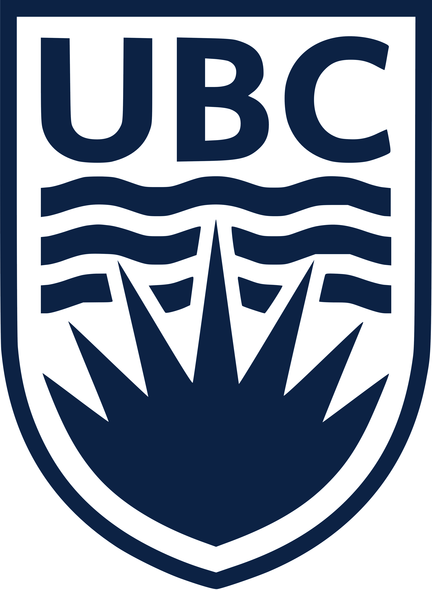
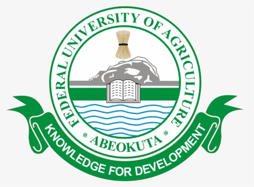

::: {.resume-page}

::: {.resume-section}
## Education

::: {.edu-list}

::: {.edu-item}
::: {.school-logo}

:::

::: {}

  <h3>Master of Geomatics for Environmental Management</h3>
  Expected Apr. 2026

<em>University of British Columbia (UBC), Vancouver, BC, Canada</em>

:::
:::

::: {.edu-item}
::: {.school-logo}

:::

::: {}

  <h3>Micro-credential in Geospatial Data Analysis</h3>
  Apr. 2024

<em>Seneca Polytechnic, Toronto, ON, Canada</em>

:::
:::

::: {.edu-item}
::: {.school-logo}

:::

::: {}

  <h3>Bachelor of Forestry and Wildlife Management</h3>
  Feb. 2020

<em>Federal University of Agriculture, Abeokuta (FUNAAB), Ogun, Nigeria</em>

:::
:::

:::
:::

::: {.resume-section}
## Skills

::: {.skill-pills}
[ArcGIS Pro]{.skill-pill}
[QGIS]{.skill-pill}
[ENVI]{.skill-pill}
[Google Earth Engine]{.skill-pill}
[Spatial Modelling]{.skill-pill}
[R]{.skill-pill}
[Python]{.skill-pill}
[SQL]{.skill-pill}
[Markdown]{.skill-pill}
[GitHub]{.skill-pill}
[MS Excel]{.skill-pill}
[Research]{.skill-pill}
[Project Management]{.skill-pill}
[Technical Writing]{.skill-pill}
:::

[See Projects →](content.html){.resume-link}
:::

::: {.resume-section}
## Experience

::: {.exp-list}

::: {.exp-item}

  <h3>Geospatial Analyst</h3>
  Feb. 2025 – May 2025

<em>Geospatial Research Limited, Ikeja, Lagos</em>

<ul>
  <li>Updated about 30,000 geodatabases of building footprints in Lagos State, Nigeria.</li>
  <li>Conducted spatial analysis of Lagos State road networks, signages, and markings to support transport management.</li>
</ul>

:::

::: {.exp-item}

  <h3>Associate Agronomist</h3>
  Aug. 2020 – Jan. 2024

<em>GBFOODS, Tomani Farms & Agro. Industry Limited, Kebbi, Nigeria</em>

<ul>
  <li>Monitored an 800-hectare farm using UAVs and satellite imagery.</li>
  <li>Supervised precision tools and decision support systems.</li>
  <li>Sensitized 200 local farmers on agrochemical use and sustainable agriculture.</li>
</ul>

:::

::: {.exp-item}

  <h3>Geospatial Data Analyst</h3>
  May 2024

<em>Citizen Science, Ayobo Local Council Development Area, Lagos, Nigeria</em>

<ul>
  <li>Conducted municipal projects to analyze traffic and security conditions.</li>
  <li>Proposed measures to improve well-being and safety conditions within the community.</li>
</ul>

:::

::: {.exp-item}

  <h3>Geospatial Data Analyst Intern</h3>
  Nov. 2018 – Jan. 2020

<em>Department of Forestry & Wildlife Management, FUNAAB</em>

<ul>
  <li>Created maps of study locations for 10 undergraduate research projects.</li>
  <li>Developed geospatial data collection forms and field applications.</li>
  <li>Updated topographic maps of the university with new thematic features.</li>
</ul>

:::

:::
:::

::: {.resume-section}
## Master’s Capstone Project

::: {.capstone-list}

::: {.capstone-item}

  <h3>Assessing Critical Transitions in Agricultural Landscapes in the Lower Fraser Valley</h3>
  Aug. 2025 – May 2026

<ul>
  <li>Harmonized multi-source land-cover and agricultural datasets to detect changes in the LFV between 2015 and 2020.</li>
  <li>Produced 30 m land-cover outputs to quantify land-cover change, characterize landscape structure, and identify key transitions.</li>
  <li>Evaluated fragmentation, connectivity, and spatial patterns to support interpretation of ecological and agricultural landscape change.</li>
  <li>Identified priority areas for perennial agricultural expansion to inform sustainable land management.</li>
</ul>

  <a href="capstone.html" class="resume-link">View Capstone Project →</a>

:::

:::
:::

::: {.resume-section}
## Publications

::: {.pub-list}

::: {.pub-item}

  <h3>Peer-Reviewed Publication</h3>

Ezekiel, O., Yisau, J. A., & Aduradola, A. M. (2024). <em>Effect of watering regime and mycorrhizal inoculation on the growth of Baobab (Adansonia digitata).</em> <em>Journal of Agriculture and Environment for International Development, 118</em>(1), 5–18.

  <a href="https://doi.org/10.36253/jaeid-12082" class="resume-link">View publication →</a>

:::

:::
:::

::: {.resume-section}
## Volunteering & Service

::: {.service-list}

::: {.service-item}

  <h3>GitHub Contributor — Open Geomatics Textbook Revision</h3>
  Nov. 2025 – Present

<em>UBC Geomatics Community of Practice</em>

Contributing to the revision of the Open Geomatics textbook for advanced GIS learning and community-based geospatial education.

  <a href="https://github.com/ubc-geomatics-community-of-practice/GEM511-Advanced-GIS-for-Environmental-Management" class="resume-link">View GitHub Repository →</a>

:::

::: {.service-item}

  <h3>Peer Reviewer</h3>
  Aug. 2022 – Present

<em>Journal of Forestry Research; Current Agriculture Research Journal</em>

Reviewed research articles and provided publication feedback, supporting research quality and editorial evaluation in forestry and agriculture.

  <a href="https://orcid.org/0009-0006-4772-9538" class="resume-link">See verified reviews here →</a>

:::

:::
:::

::: {.resume-section}
## Training & Professional Development

::: {.training-list}

::: {.training-item}

- Drought Monitoring, Prediction, and Projection using NASA Earth System Data — NASA ARSET, Oct. 2024  
- Invasive Species Monitoring with Remote Sensing — NASA ARSET, Oct. 2024  
- CO2 Measurements for Climate-Related Studies — NASA ARSET, Oct. 2024  
- Introduction to Agent Based Modeling — Geoversity, University of Twente, Sep. 2024  
- UAVs in Precision Agriculture — Geoversity, University of Twente (ITC), Aug. 2024  
- Geo Web App Building with Open-Source Tools — Geoversity, ITC, Aug. 2024  
- Remote Sensing Image Acquisition, Analysis and Applications — Coursera, Jul. 2024

  <a href="https://drive.google.com/file/d/1Tfz0730ozpZtY_sC8khtmHXsZX5fPI7B/view?usp=sharing" class="resume-link">View training certificates here →</a>

:::

:::
:::

::: {.resume-section}
## Awards & Honors

::: {.award-list}

::: {.award-item}

- Fully funded master’s program at UBC — Mastercard Foundation Scholarship, 2025  
- Fully funded micro-credential in GIS — Seneca Polytechnic / Quick Train Canada, 2024  
- Award of Meritorious Service — GBFOODS Africa, 2023  
- Reviewer of the Year — Current Agriculture Research Journal, 2022  
- Data Science Microdegree Scholarship — USTACKY, 2021  
- Best Graduating Student, Department of Forestry and Wildlife Management — FUNAAB Senate Awards, 2020

:::

:::
:::

:::