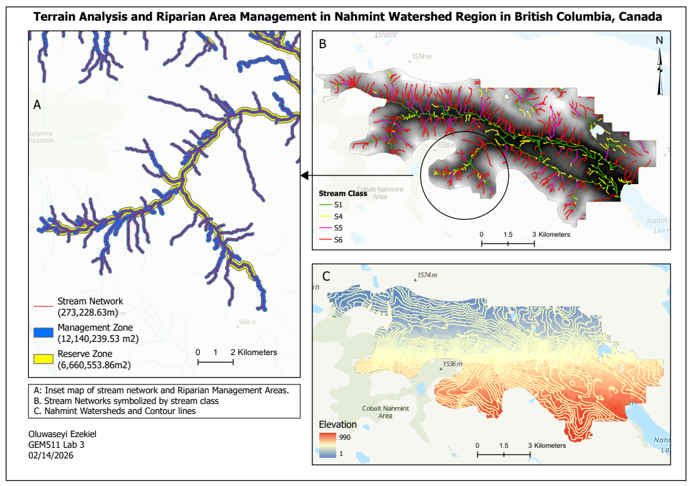

[← Back to Projects](content.html#cartography-page)

# Riparian Terrain Analysis and Forest Management Planning

📍 Nahmint Valley, Vancouver Island, BC 📅 February 2026

**Tools**: ArcGIS Pro · Python · Spatial Analyst

------------------------------------------------------------------------

## The Problem

### *Protecting streams before Harvesting*

Riparian areas — forests adjacent to streams, lakes, and wetlands — stabilize stream banks, regulate water temperature, and reduce runoff. Under BC's Forest Practices Code, Riparian Management Areas (RMAs) must be defined before harvesting can occur. The width of these legally required buffer zones depends on stream class, determined by channel width and fish-bearing potential.

This project simulates a real-world forest management workflow — mapping stream networks, classifying streams, and delineating Reserve and Management Zones across the Nahmint Valley watershed.

------------------------------------------------------------------------

## Data

### *A DEM from the UBC PostgreSQL server*

The DEM for the Nahmint watershed was accessed from the UBC PostgreSQL server and exported as a GeoTIFF for processing in ArcGIS Pro. ArcGIS basemap satellite imagery was used to validate the derived stream network and estimate channel widths.

------------------------------------------------------------------------

## Step 1 — DEM Preprocessing

### *Filling the gaps before modeling flow*

Sinks — small depressions in the DEM where water pools unrealistically — were removed using the **Fill** tool. Skipping this step breaks the flow network downstream.

**Flow Direction** (D8 algorithm) was then calculated, directing each cell's flow to its steepest downslope neighbour. **Flow Accumulation** counted how many upstream cells drain through each point — the foundation for stream delineation.

------------------------------------------------------------------------

## Step 2 — Stream Network

### *Finding streams from elevation alone*

A flow accumulation threshold was selected by comparing the derived network against basemap imagery — balancing realistic stream capture against false channel extraction. The raster was **Reclassified** to isolate stream cells, then **Stream Order** (Strahler method) was assigned to each segment. **Stream to Feature** converted the raster network to polylines.

------------------------------------------------------------------------

## Step 3 — Stream Characteristics

### *Gradient and width*

Percent gradient was calculated using **Zonal Statistics** and **Raster Calculator**. Streams with gradient below 20% were classified as fish-bearing under BC guidelines. Channel widths were estimated from basemap imagery for a stratified sample per stream order, then assigned to all segments using Python scripting in ArcGIS Pro's Calculate Field tool:

``` python
def reclass(Order):
    if Order == 1:
        return 1
    elif Order == 2:
        return [measured avg width]
    elif Order == 3:
        return [measured avg width]
    else:
        return [measured avg width]
```

------------------------------------------------------------------------

## Step 4 — Riparian Management Areas

### *Drawing the line between harvest and protection*

BC stream classes (S2–S6) were assigned using conditional Python logic based on gradient and width thresholds. Variable-width buffer distances for Reserve Zones (no harvest) and Management Zones (limited harvest) were applied using the **Buffer** tool with field-based distances. Watershed boundaries were delineated using the **Watershed** tool.

------------------------------------------------------------------------

## Results

### *273 km of streams \| 1,880 ha protected*



*Figure 1. Stream network symbolized by stream class (S1, S4, S5, S6), Reserve and Management Zones, watershed boundaries, and contour lines — Nahmint Valley, BC.*

The analysis delineated a stream network totalling **273 km**, classified into stream classes S1, S4, S5, and S6. Reserve Zones covered approximately **666 ha**, while Management Zones spanned approximately **1,214 ha** — bringing total riparian protection to nearly **1,880 ha**. The watershed spans an elevation range of 1m to 1,574m, with higher-order streams concentrated along the main valley bottom.

| Zone                              | Area       |
|-----------------------------------|------------|
| Reserve Zone (no harvest)         | \~666 ha   |
| Management Zone (limited harvest) | \~1,214 ha |
| Total protected area              | \~1,880 ha |
| Stream network length             | \~273 km   |

------------------------------------------------------------------------

## Project Significance

This project reflects the kind of spatial analysis applied by forest managers, consultants, and government agencies operating under BC's Forest Practices Code. The use of Python scripting to automate stream classification and buffer assignment illustrates how GIS automation can efficiently handle complex, rule-based spatial decisions across large stream networks.
