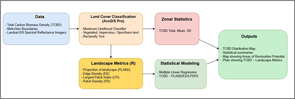
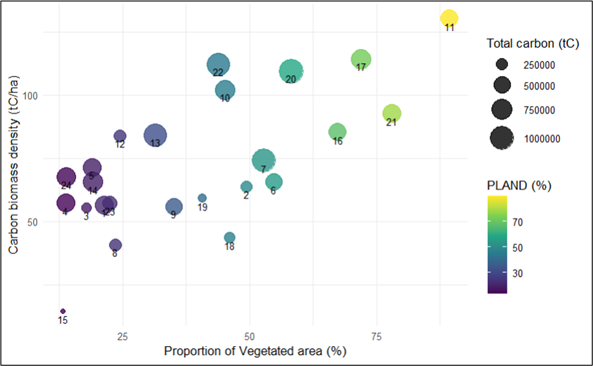

[← Back to Projects](content.html){.back-btn}

### Mapping Spatial Patterns of Urban Carbon Sinks in Metro Vancouver

**Research Proposal — University of British Columbia**  
**GEM 500: Landscape Ecology**

---

## Summary

Urban carbon sinks are vegetated areas such as urban forests, parks, street trees, and remnant green spaces that capture and store atmospheric carbon through plant biomass and soil processes. These ecosystems play an important role in climate mitigation by removing carbon dioxide from the atmosphere and storing it in vegetation and soils. 

In **Metro Vancouver**, rapid urban expansion has increased impervious surface cover and fragmented vegetated landscapes, reducing the region’s capacity for carbon sequestration. While many urban forestry assessments focus primarily on canopy cover, fewer studies evaluate **how spatial patterns of vegetation and landscape configuration influence carbon storage capacity**.

This study proposes to map the spatial distribution of **urban carbon sinks across Metro Vancouver municipalities** and examine how landscape structure—such as vegetation extent, fragmentation, and connectivity—affects carbon biomass density.

The project addresses two key research questions:

- Which municipalities in Metro Vancouver function as the **largest urban carbon sinks**?
- How do **spatial patterns of vegetation and impervious surfaces** influence carbon storage capacity?

---

<link rel="stylesheet" href="https://unpkg.com/leaflet@1.9.4/dist/leaflet.css"/>

---

## Methods

This study integrates **remote sensing data, carbon biomass datasets, and landscape metrics** to examine spatial patterns of urban carbon storage across Metro Vancouver municipalities.

Carbon biomass density data (tC/ha) and municipal boundaries will be obtained from the **Metro Vancouver Open Data Portal**, while **Landsat 8 and 9 surface reflectance imagery (30 m resolution)** will be acquired from the USGS EarthExplorer platform. :contentReference[oaicite:0]{index=0}

Land-cover classification will be performed in **ArcGIS Pro** using a supervised maximum likelihood classifier to distinguish three primary classes: vegetated areas, impervious surfaces, and open land.

To evaluate spatial patterns of vegetation, landscape metrics will be calculated using the **landscapemetrics package in R**, including:

- **PLAND** – proportion of vegetated land cover  
- **Edge Density (ED)** – fragmentation between vegetation and impervious surfaces  
- **Largest Patch Index (LPI)** – size of the largest contiguous vegetation patch  
- **Patch Density (PD)** – distribution of vegetation patches

Finally, **multiple linear regression** will be used to examine relationships between carbon biomass density and landscape structure across municipalities.

*Figure. Proposed workflow for mapping spatial patterns of urban carbon sinks in Metro Vancouver.*

---

## Expected Results

The study is expected to generate a **spatial map of carbon biomass density across Metro Vancouver municipalities**.

Municipalities with **larger and more contiguous vegetated areas** are expected to show higher carbon biomass density, while highly fragmented landscapes dominated by impervious surfaces may exhibit lower carbon storage capacity.

However, vegetation extent alone may not fully explain carbon storage patterns. Differences in vegetation type, canopy structure, and biomass accumulation may produce variation in carbon storage even among areas with similar vegetated cover.

*Figure 2. Expected relationship between proportion of landscape vegetated (PLAND) and carbon biomass density.*

This analysis will help reveal whether **landscape structure and vegetation configuration influence carbon storage potential within urban environments**.

---

## Project Significance

Understanding spatial patterns of urban carbon sinks is essential for supporting climate mitigation strategies in rapidly urbanizing regions.

This study will help identify:

- municipalities with **high carbon storage capacity**
- areas where **green infrastructure expansion could increase carbon sequestration**
- locations where **urban restoration efforts may have the greatest environmental impact**

The findings can inform **urban forestry planning, climate policy, and green infrastructure initiatives** aimed at improving ecosystem services and climate resilience across Metro Vancouver.